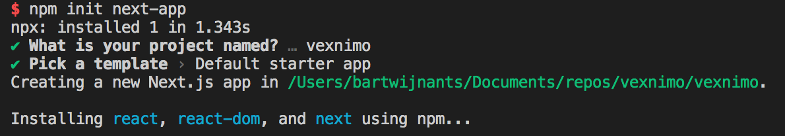
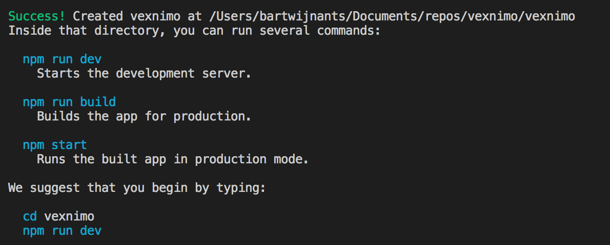

# vexnimo

## How to create a Next.js app using serverless functions, AWS Cognito and DynamoDB and deploy it on Vercel for free

Vexnimo is a full blown publicly available web app including authentication and database persistence using only free services.

This is not as simple as using [AWS Amplify](https://aws.amazon.com/amplify/) or [Firebase](https://firebase.google.com/) but AWS Amplify is only free for 12 months and Firebase limits you to only a handful of projects.

Vexnimo uses [Next.js](https://nextjs.org/) hosted on [Vercel](https://vercel.com/) for frontend and serverless functions, [AWS Cognito](https://aws.amazon.com/cognito/) for authentication and [DynamoDB](https://aws.amazon.com/dynamodb/) as the database.

### Prerequisites

- [Git](https://git-scm.com/)
- [Node.js](https://nodejs.org/)
- A [GitHub](https://github.com/), [GitLab](https://gitlab.com/) or [BitBucket](https://bitbucket.org/) account
- Something to code in and a terminal, is just use [vscode](https://code.visualstudio.com/)

That's about all you need.

### Step 1: Deploy to production

I'm going to start where most projects want to end, a successful production deployment.

I'm going to use [Next.js](https://nextjs.org/) a React framework that makes it really easy to create web apps and [Vercel](https://vercel.com/), a company that makes it really easy to take that web app to the web to make that happen.

Fire up your terminal and let's get going.

```shell
npm init next-app
```



After a long analysis session I picked "vexnimo" as the name for my project. If you look carefully you will see that "vexnimo" consists of characters from the Latin alphabet. Those letters also appear in the main technologies used in this project. That's all the naming inspiration I have left.

I figured I spent enough time thinking about a name so I just went with the Default starter app as a template.



If you do as the terminal says, you can see your app working!

```shell
cd vexnimo
npm run dev
```

#### Prettier detour

Before I can start working on a JavaScript project I always make sure Prettier is installed. It's just so much faster to code if you can auto-format every 3.8 seconds.

When I'm in Visual Studio Code I always use the built in terminal. You can show the integrated terminal by using the ⌃` (control + backtick) shortcut when you're on macOS like me. The same Visual Studio keyboard shortcut also exists for Windows and Linux.

Now back to Prettier. After installing Prettier and creating an empty config you can hit ⇧⌥F (shift + command + f) when you are working in a file to format it.

```shell
npm install --save-dev prettier
echo "{}" >> .prettierrc
```

I copied the Prettier intermezzo from one of my other [articles](https://levelup.gitconnected.com/agnita-authentication-for-create-react-app-using-aws-cognito-80cde1fb781b) because I really like Prettier, but I did not want to come up with all that stuff again.

I do have to mention one more thing about Prettier. When you build a Next.js app, Next.js creates a `.next` folder where it puts all kinds of compiled files. There's no need to format these, you don't even need to check it in. But Prettier doesn't know this so you should tell Prettier.

```shell
echo ".next" >> .prettierignore
```

Now you can add a script to your `package.json` to format your full project.

```json
"format": "prettier --write \"**/*.{js,jsx,json,md}\""
```

```shell
npm run format
```

#### Back on track

### License

This repo is licensed under the [MIT License](LICENSE).
