# vexnimo

## How to create a Next.js app using serverless functions, AWS Cognito and DynamoDB and deploy it on Vercel for free

Vexnimo is a full blown publicly available web app including authentication and database persistence using only free services.

This is not as simple as using [AWS Amplify](https://aws.amazon.com/amplify/) or [Firebase](https://firebase.google.com/) but AWS Amplify is only free for 12 months and Firebase limits you to only a handful of projects.

Vexnimo uses [Next.js](https://nextjs.org/) hosted on [Vercel](https://vercel.com/) for frontend and serverless functions, [AWS Cognito](https://aws.amazon.com/cognito/) for authentication and [DynamoDB](https://aws.amazon.com/dynamodb/) as the database.

### Prerequisites

- [Git](https://git-scm.com/)
- [Node.js](https://nodejs.org/)
- A [GitHub](https://github.com/), [GitLab](https://gitlab.com/) or [BitBucket](https://bitbucket.org/) account
- Something to code in and a terminal, is just use [vscode](https://code.visualstudio.com/)

That's about all you need.

### Step 1: Deploy to production

I'm going to start where most projects want to end, a successful production deployment.

I'm going to use [Next.js](https://nextjs.org/) a React framework that makes it really easy to create web apps and [Vercel](https://vercel.com/), a company that makes it really easy to take that web app to the web to make that happen.

Fire up your terminal and let's get going.

```shell
npm init next-app
```


After a long analysis session I picked "vexnimo" as the name for my project. If you look carefully you will see that "vexnimo" consists of characters from the Latin alphabet. Those letters also appear in the main technologies used in this project. That's all the naming inspiration I have left.

I figured I spent enough time thinking about a name so I just went with the Default starter app as a template.


If you do as the terminal says, you can see your app working!

```shell
cd vexnimo
npm run dev
```

#### Prettier detour

Before I can start working on a JavaScript project I always make sure Prettier is installed. It's just so much faster to code if you can auto-format every 3.8 seconds.

When I'm in Visual Studio Code I always use the built in terminal. You can show the integrated terminal by using the ⌃` (control + backtick) shortcut when you're on macOS like me. The same Visual Studio keyboard shortcut also exists for Windows and Linux.

Now back to Prettier. After installing Prettier and creating an empty config you can hit ⇧⌥F (shift + command + f) when you are working in a file to format it.

```shell
npm install --save-dev prettier
echo "{}" >> .prettierrc
```

I copied the Prettier intermezzo from one of my other [articles](https://levelup.gitconnected.com/agnita-authentication-for-create-react-app-using-aws-cognito-80cde1fb781b) because I really like Prettier, but I did not want to come up with all that stuff again.

I do have to mention one more thing about Prettier. When you build a Next.js app, Next.js creates a `.next` folder where it puts all kinds of compiled files. There's no need to format these, you don't even need to check it in. But Prettier doesn't know this so you should tell Prettier.

```shell
echo ".next" >> .prettierignore
```

Now you can add a script to your `package.json` to format your full project.

```json
"format": "prettier --write \"**/*.{js,jsx,json,md}\""
```

```shell
npm run format
```

#### Back on track

Now that you have a running website it's time to deploy it. Commit everything and push it to GitHub, GitLab or BitBucket. Now sign up to [Vercel](https://vercel.com/signup) by choosing your cloud Git provider.

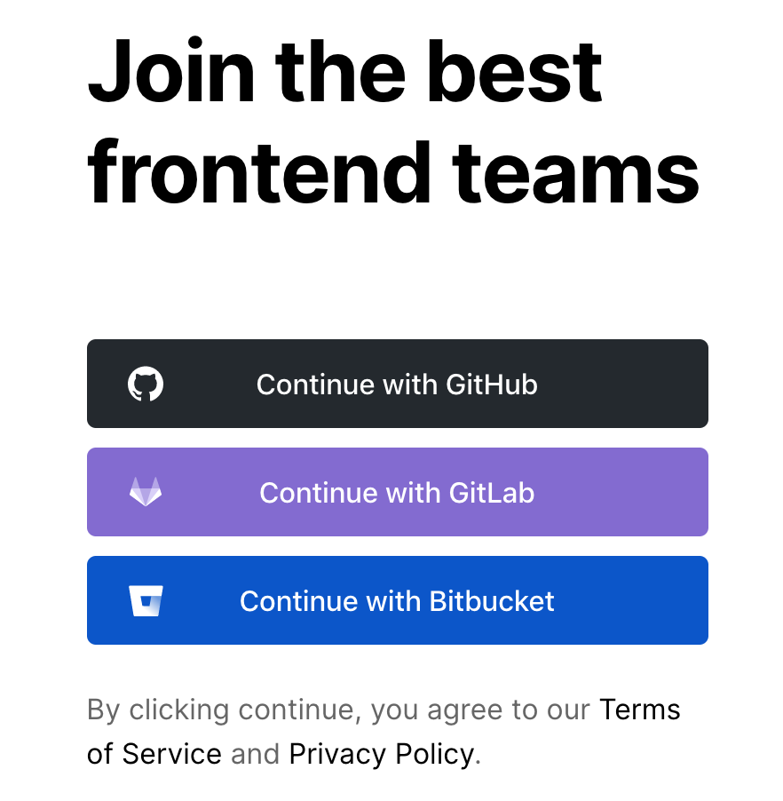

One more click to authorize Vercel on your cloud Git provider and you are ready to deploy. 

Now you should be on your Vercel dashboard and should see a nice black "Import Project" button. I did not think twice and just clicked it, then I just kept on clicking until my project was deployed!

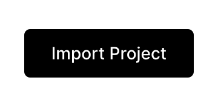

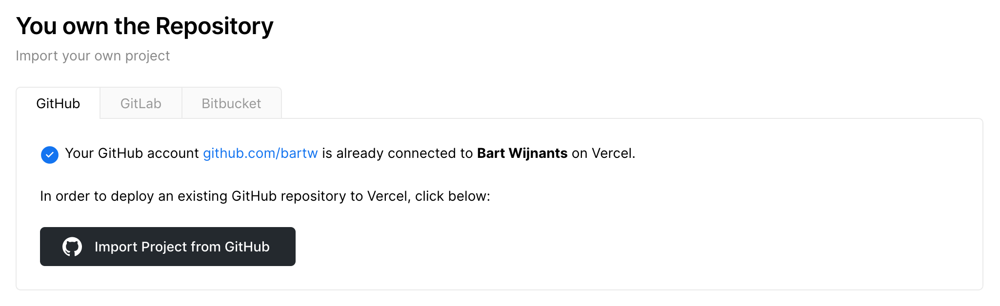

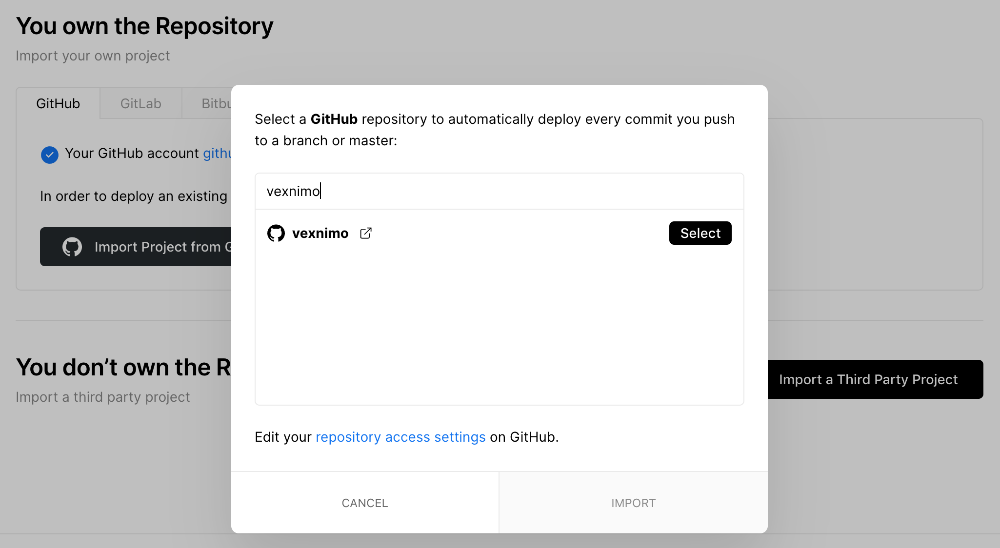

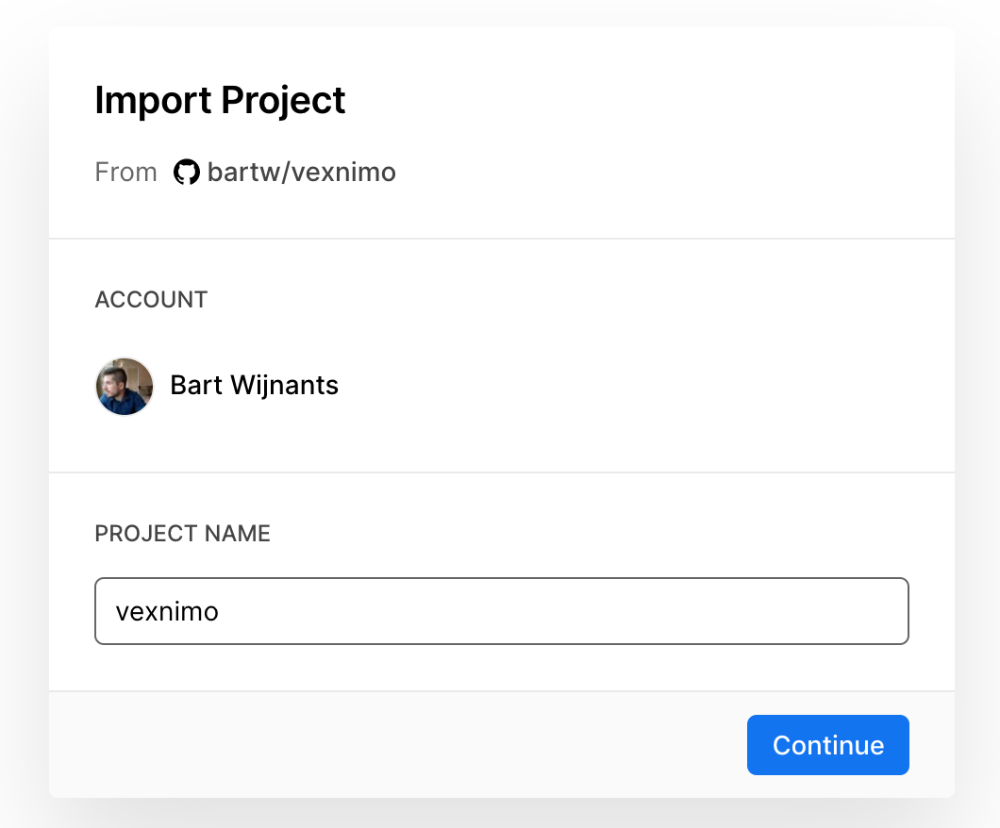

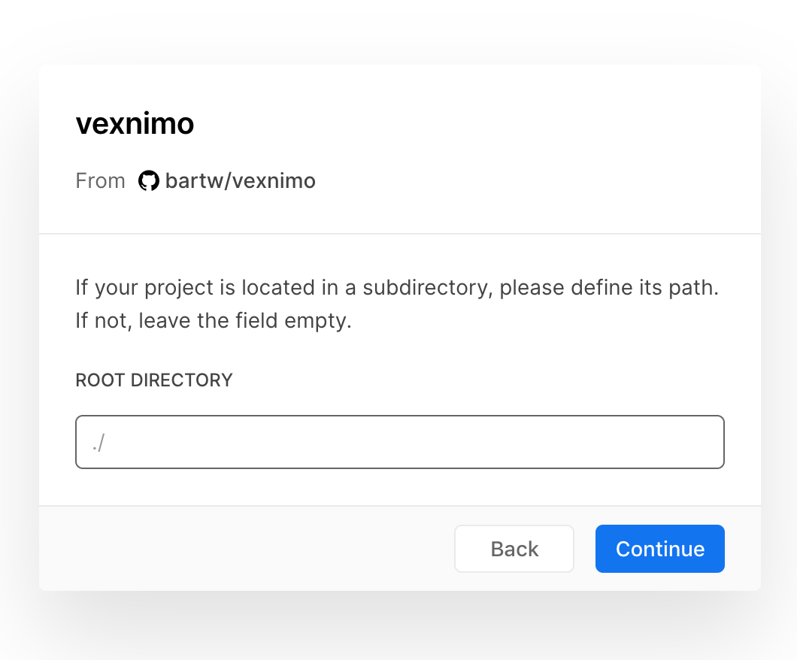

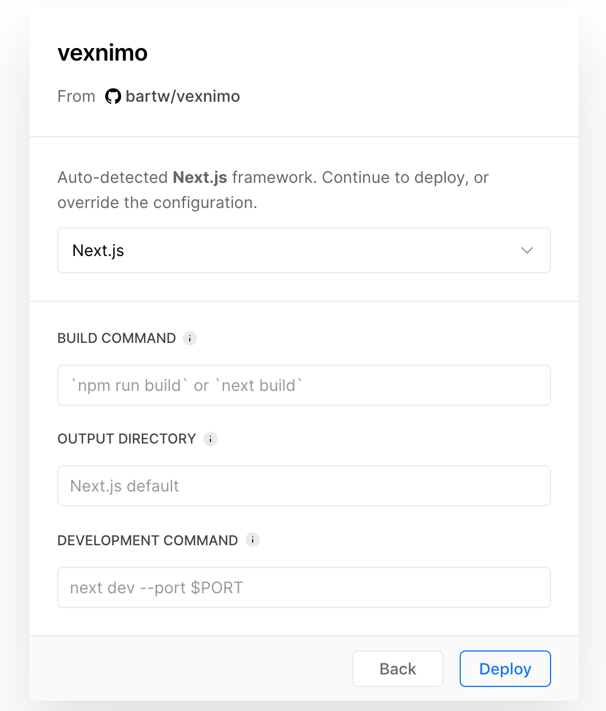

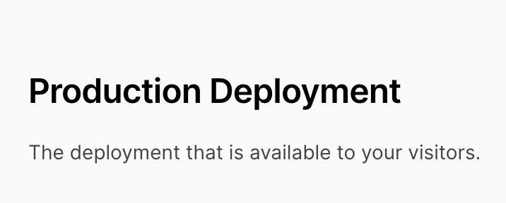

Now I have a website running on https://vexnimo.now.sh/ that will update on each push to master. 

Time for step 2.

### Authentication using AWS Cognito

My previous article was about [Authentication for Create React App using AWS Cognito](https://medium.com/@bartwijnants/agnita-authentication-for-create-react-app-using-aws-cognito-80cde1fb781b), the first part of that article talks about setting up the [AWS Cognito](https://aws.amazon.com/cognito/) side of things, I set up Cognito for this project using that article and you can too.

The frontend side will be different though because I'm now using Next.js instead of [CRA](https://create-react-app.dev/) and because I'm not going for a proof of concept but an actual app.

Get ready for a bunch of code.

I'm going to start with the configuration. I'm going to create a `.env` file in the root of my project and make sure that this file is added to `.gitignore` so we don't leak any configuration to the public.

```
REGION=us-east-1
USER_POOL_ID=us-east-1_ddAwURgHu
USER_POOL_WEB_CLIENT_ID=11nhk5jjpd5pfd35f24qredtyf
IDENTITY_POOL_ID=us-east-1:0b1b9456-789w-4532-nv31-1b8230fb8d72
```

If you don't push this file to Git then there must be a way to let Vercel know that these environment variables exist. And that way is the Vercel dashboard.

Browse to https://vercel.com/dashboard and click on your project.

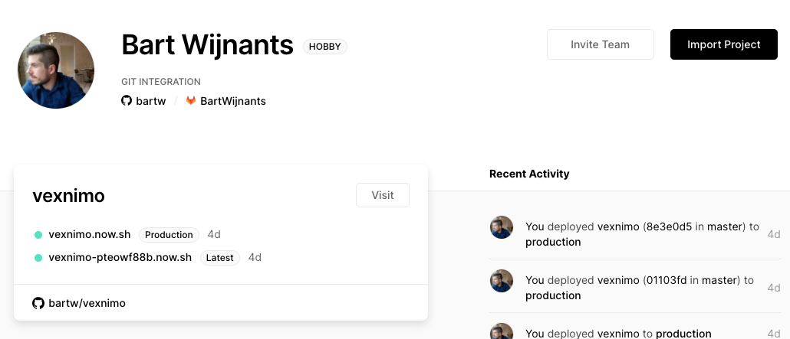

In the menu of project you can go to the settings page.

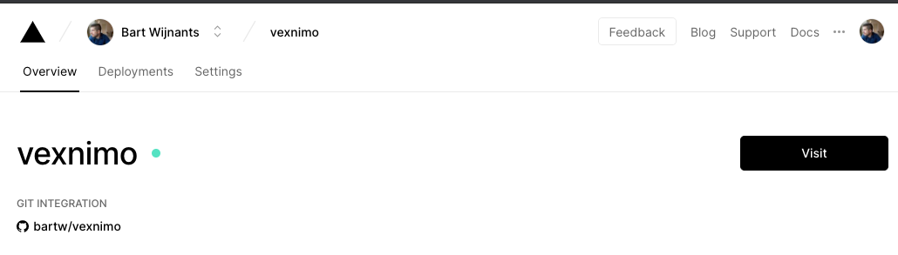

And if you scroll down in the general tab of the settings you will see an Environment Variables block where you can add the same environment variables.

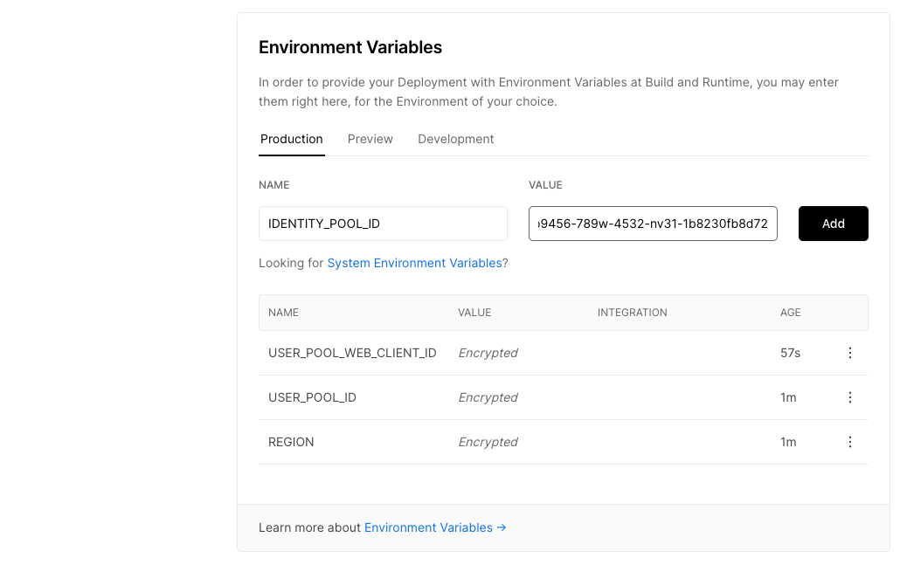

Next.js requires on extra step to expose the environment variables to your application: `next.config.js`. 

```js
module.exports = {
  env: {
    REGION: process.env.REGION,
    USER_POOL_ID: process.env.USER_POOL_ID,
    USER_POOL_WEB_CLIENT_ID: process.env.USER_POOL_WEB_CLIENT_ID,
    IDENTITY_POOL_ID: process.env.IDENTITY_POOL_ID,
  },
};
```

Now let's install some dependencies. I've become a little smarter since my previous article. I found out that you can install only the dependencies of [aws-amplify](https://github.com/aws-amplify/amplify-js) that you use so you don't need to install the whole thing.

```shell
npm install --save @aws-amplify/core @aws-amplify/auth
```

```shell
mkdir auth
touch auth/auth.js
touch auth/context.js
touch auth/use-auth.js
touch auth/use-is-authenticated.js
touch auth/use-redirect-authenticated.js
touch auth/use-redirect-unauthenticated.js
touch auth/index.js
```

```js
import Amplify, { Hub } from "@aws-amplify/core";
import AmplifyAuth from "@aws-amplify/auth";

let callbacks = [];
let isAuthenticated = false;

const uuid = () =>
  "xxxxxxxx-xxxx-4xxx-yxxx-xxxxxxxxxxxx".replace(/[xy]/g, function (c) {
    var r = (Math.random() * 16) | 0,
      v = c === "x" ? r : (r & 0x3) | 0x8;
    return v.toString(16);
  });

const fireCallbacks = () =>
  callbacks.forEach((cb) => cb.callback(isAuthenticated));

class Auth {
  constructor() {
    Amplify.configure({
      Auth: {
        region: process.env.REGION,
        userPoolId: process.env.USER_POOL_ID,
        userPoolWebClientId: process.env.USER_POOL_WEB_CLIENT_ID,
      },
    });

    const listener = (data) => {
      switch (data.payload.event) {
        case "signIn":
          isAuthenticated = true;
          fireCallbacks();
          break;
        case "signOut":
          isAuthenticated = false;
          fireCallbacks();
          break;
        case "signIn_failure":
        case "signUp_failure":
        case "configured":
          break;
        default:
          console.log("unhandled auth event:", data.payload.event);
      }
    };

    Hub.listen("auth", listener);
  }

  initialize() {
    return AmplifyAuth.currentSession()
      .then(() => {
        isAuthenticated = true;
        fireCallbacks();
      })
      .catch(() => {
        isAuthenticated = false;
        fireCallbacks();
      });
  }

  isAuthenticated() {
    return isAuthenticated;
  }

  onAuthStateChanged(callback) {
    const id = uuid();
    callbacks = [...callbacks, { id, callback }];
    return () => {
      callbacks = callbacks.filter((cb) => id !== cb.id);
    };
  }

  token() {
    return AmplifyAuth.currentSession()
      .then((session) => session.getIdToken())
      .then((accessToken) => accessToken.getJwtToken())
      .catch(() => null);
  }

  signUp({ email, password }) {
    return AmplifyAuth.signUp({
      username: email,
      password,
      attributes: { email },
    }).then(() => {});
  }

  confirmSignUp({ email, confirmationCode }) {
    return AmplifyAuth.confirmSignUp(email, confirmationCode).then(() => {});
  }

  resendConfirmationCode({ email }) {
    return AmplifyAuth.resendSignUp(email).then(() => {});
  }

  signIn({ email, password }) {
    return AmplifyAuth.signIn(email, password).then(() => {});
  }

  signOut() {
    AmplifyAuth.signOut();
  }
}

export default Auth;
```

```js
import { createContext } from "react";

const AuthContext = createContext(null);

export default AuthContext;
```

```js
import { useContext } from "react";
import AuthContext from "./context";

const useAuth = () => {
  const auth = useContext(AuthContext);

  if (!auth) {
    throw new Error("Auth is not available");
  }

  return auth;
};

export default useAuth;
```

```js
import { useState, useEffect } from "react";
import useAuth from "./use-auth";

const useIsAuthenticated = () => {
  const auth = useAuth();

  const [isAuthenticated, setIsAuthenticated] = useState(
    auth.isAuthenticated()
  );

  useEffect(
    () =>
      auth.onAuthStateChanged((isAuthenticated) => {
        setIsAuthenticated(isAuthenticated);
      }),
    [auth]
  );

  return isAuthenticated;
};

export default useIsAuthenticated;
```

```js
import Router from "next/router";
import useIsAuthenticated from "./use-is-authenticated";

const useRedirectAuthenticated = () => {
  const isAuthenticated = useIsAuthenticated();

  if (isAuthenticated) {
    Router.push("/dashboard");
  }
};

export default useRedirectAuthenticated;
```

```js
import Router from "next/router";
import useIsAuthenticated from "./use-is-authenticated";

const useRedirectUnauthenticated = () => {
  const isAuthenticated = useIsAuthenticated();

  if (!isAuthenticated) {
    Router.push("/");
  }
};

export default useRedirectUnauthenticated;
```

```js
import Auth from "./auth";
import AuthContext from "./context";
import useAuth from "./use-auth";
import useIsAuthenticated from "./use-is-authenticated";
import useRedirectUnauthenticated from "./use-redirect-unauthenticated";
import useRedirectAuthenticated from "./use-redirect-authenticated";

export default Auth;
export {
  AuthContext,
  useAuth,
  useIsAuthenticated,
  useRedirectUnauthenticated,
  useRedirectAuthenticated,
};
```

### License

This repo is licensed under the [MIT License](LICENSE).
